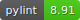
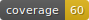

<div align="center">
    <h1 style="font-size: large; font-weight: bold;">Robust-ML</h1>
</div><div align="center">
	<a href="#">
        
    </a>
    <a href="#">
        
    </a>
    <a href="#">
        
    </a>
    </a>
	<a href="_static/pylint/pylint.txt">
        
    </a>
    <a href="_static/flake8/index.html">
        
    </a>
	<a href="_static/coverage/index.html">
        
    </a>
</div>
<br>

Robust-ml is a library of training methods designed to improve the robustness of computer vision models.
Warning : This library requires to have a GPU, CPU-only mode is not supported.
## Getting started

To install and use the library, it is recommended to create a Python virtual environment. You can do that with virtualenv, as follows:

### Setting environement
```bash
pip install virtualenv
virtualenv -p <path/to/python3.9> myenv
source myenv/bin/activate
```
### Installation
Once your virtual environment is activated, you can install the uqmodels library directly from Pypi by typing :

```bash
pip install robust-ml
```

This command will install the robust-ml package and all required dependencies.

## Input/Output

### Input

Advertrain takes a torch dataloader as input.

### Ouput

As output, the library returns a model saved as a local .pth file.

## Example

You have to generate a dataloader in pytorch.

```
trainer = AdversarialTraining(model=your_architecture, optimizer=your_optimizer, loss_func=your_criterion, device=your_device, epsilon=your_epsilon)
trainer.fit(epochs=2, train_dataloader=your_train_dataloader, val_dataloader=your_val_dataloader, patience=2, checkpoint=your_path)
```

For more informations, you can follow the notebook example here :
[Notebook](examples/training.ipynb)

## Architectures

The library provides six neural network architectures. More specifically, two main architectures are implemented, as well as two derived architectures for each of them :

- ConvNet
- ConvNet with DropBlock regularization
- ResNet
- ResNet with DropBlock regularization

### ConvNet

A Convolutional Neural Network (ConvNet or CNN) is a type of deep learning algorithm primarily used for processing data with a grid-like topology, such as images, using convolutional layers to automatically and adaptively learn spatial hierarchies of features.

### ResNet

ResNet, short for Residual Network, is a type of convolutional neural network (CNN) that introduces residual connections or "shortcuts" to jump over some layers, helping to solve the vanishing gradient problem and enabling the training of much deeper networks.

### Dropout

Dropout is a regularization technique for reducing overfitting in neural networks by preventing complex co-adaptations on training data.

### DropBlock

"DropBlock is a structured form of dropout directed at regularizing convolutional networks. In DropBlock, units in a contiguous region of a feature map are dropped together. As DropBlock discards features in a correlated area, the networks must look elsewhere for evidence to fit the data."

[Paper](https://arxiv.org/abs/1810.12890v1) \
[Code](https://github.com/miguelvr/dropblock/blob/7fb8fbfcb197a4bb57dc9193bcd6f375ff683f85/dropblock/dropblock.py#L6)

## Training methods

Acutally two training methods are available. They take the form of three classes :

- ClassicalTraining
- AdversarialTraining
- AutoAttackTraining
- FireTraining
- TradesTraining

### ClassicalTraining

This is the class to train a model without considering improved robustness.

All other training methods inherit from this class.

### AdversarialTraining

This is the class to train model against adversarial attack. This method is based on an external :
[cleverhans](https://github.com/cleverhans-lab/cleverhans)

### AutoAttackTraining

"Reliable evaluation of adversarial robustness with an ensemble of diverse parameter-free attacks"
Francesco Croce, Matthias Hein
ICML 2020
[AutoAttack](https://github.com/fra31/auto-attack)

### FireTraining

"Reliable evaluation of adversarial robustness with an ensemble of diverse parameter-free attacks"
Francesco Croce, Matthias Hein
ICML 2020
[Fire](https://github.com/MarinePICOT/Adversarial-Robustness-via-Fisher-Rao-Regularization/blob/main/src/losses.py)

### TradesTraining

TRADES minimizes a regularized surrogate loss L(.,.) (e.g., the cross-entropy loss) for adversarial training
[Trades](https://github.com/yaodongyu/TRADES)

## Contributors and Support

<p align="center">
  UQmodels is developped by 
  <a href="https://www.irt-systemx.fr/" title="IRT SystemX">
   
  </a>
  and is supported by the  
  <a href="https://www.confiance.ai/" title="Confiance.ai">
   
  </a>
</p>
